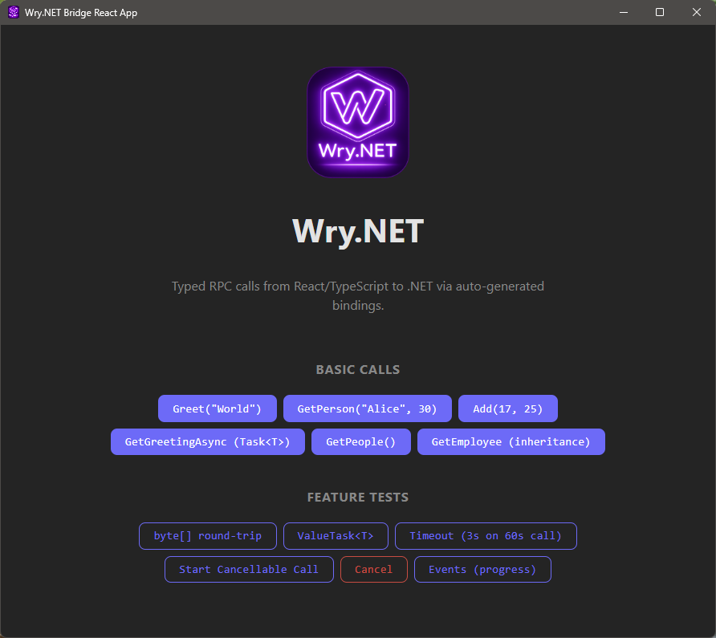

<p align="center">
  
</p>

<h1 align="center">Wry.NET</h1>

<p align="center">
  Cross-platform webview-based desktop application library for .NET using wry + tao.
</p>

<p align="center">
  <a href="https://github.com/samartzidis/Wry.NET/actions/workflows/build.yml"></a>
</p>

---

**Wry.NET** is a managed .NET wrapper around a Rust native library that provides cross-platform webview windows using [wry](https://github.com/tauri-apps/wry) (WebView2 on Windows, WebKit on macOS/Linux) and [tao](https://github.com/tauri-apps/tao) (windowing). It then includes **Wry.Bridge**, a typed RPC bridge with auto-generated TypeScript bindings for building desktop apps with various web frontends.

Build single executable desktop applications using .NET and your favourite web technology of choice. Mark your C# backend code with `[BridgeService]`, run `dotnet build`, and get fully typed TypeScript functions with IntelliSense — no manual binding code, no code generators to run separately.

<p align="center">
  
</p>

Wry.NET draws inspiration from cross-platform desktop application frameworks such as [Tauri](https://tauri.app) and [Wails](https://wails.io). Its webview component engine - [wry](https://github.com/tauri-apps/wry) - is sourced from the popular Tauri project so it's battle-tested and well-maintained.

Wry.NET differentiates itself from these frameworks by focusing on .NET for the backend and by remaining a small, unopinionated library rather than an application framework. This allows more freedom in development choices and the build process. In that respect it is closer to the [Photino.NET](https://github.com/tryphotino/photino.NET) project than to Wails or Tauri. However, it goes beyond Photino.NET by offering automatic .NET-to-TypeScript/JavaScript bindings and by building on the robust, well maintained wry library.

Its portability relies on .NET rather than in producing different native target executables per target platform. This results in more predictable cross-platform application behaviours and easier builds (no cross-compilations). As it relies on webview, and the .NET runtime, it results in very small portable executables.

## Features

- **Cross-platform webview** — WebView2 (Windows), WebKit (macOS), WebKitGTK (Linux)
- **Typed RPC** — call .NET methods from TypeScript with compile-time type safety
- **Auto-generated bindings** — services, models, enums, and events are generated as `.ts` files on build
- **Async/Await** — `Task<T>` / `ValueTask<T>` unwrap to `Promise<T>` in TypeScript
- **Cancellation** — cancel long-running .NET calls from JavaScript with `CancellationToken` auto-injection
- **Events** — push typed events from .NET to JavaScript via `bridge.Emit()`
- **Single-file publishing** — embed frontend assets into the executable and serve via custom URI scheme
- **System tray icons** — cross-platform tray icons with context menus, click events, and dynamic icon updates
- **Native dialogs** — message, ask, confirm, open file/folder, save file via `WryDialog` or the bridge's `RegisterDialogService()`
- **Zero-config build** — MSBuild `.targets` auto-imported via NuGet; `dotnet build` does everything
- **Framework agnostic** — works with React, Vue, Svelte, Angular, or plain TypeScript

## Repository Structure

| Project | What it does |
|---------|----------------|
| **wry-native** | Rust cdylib exposing a C API for wry (webview) + tao (windowing) + tray-icon (system tray). Consumed by Wry.NET via P/Invoke. For a detailed mapping of the wry 0.54.1 API to the wry-native C API, see [src/wry-native/api-coverage.md](src/wry-native/api-coverage.md). |
| **[Wry.NET](src/Wry.NET/README.md)** | Managed .NET 8 wrapper: P/Invoke bindings, events, and window lifecycle. NuGet: `Wry.NET`. |
| **[Wry.Bridge](src/Wry.Bridge/README.md)** | Typed RPC bridge: C# services callable from TypeScript with auto-generated bindings. NuGet: `Wry.Bridge`. Depends on Wry.NET. |
| **Wry.Bridge.Generator** | CLI that generates TypeScript from `[BridgeService]` assemblies. Used at build time by Wry.Bridge. |

## Quick Start

This walkthrough uses **Vite + React + TypeScript**. Other frameworks (Vue, Svelte, Angular, plain TS) work too — just adjust the scaffold command.

### 1. Create a new project

```shell
dotnet new console --use-program-main -n MyWryApp
cd MyWryApp
```

### 2. Install the NuGet packages

```shell
dotnet add package Wry.NET
dotnet add package Wry.Bridge
```

### 3. Scaffold a Vite + React + TypeScript frontend

From your .NET project root (where the `.csproj` lives):

```shell
npx create-vite@latest frontend --template react-ts
```

At the question "Install with npm and start now?" choose No.

```shell
cd frontend
npm install
cd ..
```

### 4. Configure Vite

Edit `frontend/vite.config.ts` so Vite outputs to `wwwroot/` and uses relative paths (required for the `app://` custom scheme):

```typescript
import { defineConfig } from "vite";
import react from "@vitejs/plugin-react";

export default defineConfig({
  plugins: [react()],
  base: "./",
  build: {
    outDir: "../wwwroot",
    emptyOutDir: true,
  },
});
```

### 5. Replace `Program.cs`

```csharp
using System.Reflection;
using Wry.Bridge;
using Wry.NET;

namespace MyWryApp;

class Program
{
    [STAThread]
    static void Main(string[] args)
    {
        var bridge = new WryBridge();
        bridge.RegisterDialogService()
            .RegisterService(new GreetService());

        using var app = new WryApp();
        var window = app.CreateWindow();

        window.Title = "My Wry App";
        window.Size = (1024, 768);
        window.Center();

        bridge.Attach(window);

        var devUrl = args.FirstOrDefault(a => a.StartsWith("--dev-url="))?.Split('=', 2)[1];
        window.LoadFrontend(
            assembly: Assembly.GetExecutingAssembly(),
            devUrl: devUrl);

        app.Run();
    }
}

[BridgeService]
public class GreetService
{
    public string Greet(string name) => $"Hello, {name}!";
}
```

> **Important:** The `[STAThread]` attribute is required on Windows. Without it, the WebView2 control will fail to initialize.

### 6. Call from TypeScript

Replace the contents of `frontend/src/App.tsx`:

```typescript
import { useState } from "react";
import { GreetService } from "./bindings";

function App() {
  const [message, setMessage] = useState("");

  const handleGreet = async () => {
    const result = await GreetService.Greet("World");
    setMessage(result);
  };

  return (
    <div>
      <h1>Wry.NET + React</h1>
      <button onClick={handleGreet}>Greet</button>
      {message && <p>{message}</p>}
    </div>
  );
}

export default App;
```

### 7. Build and run

```shell
dotnet build
dotnet run
```

`dotnet build` compiles the .NET project, generates TypeScript bindings in `frontend/src/bindings/`, builds the Vite frontend, and copies the output to the build directory. Click the **Greet** button to see the response from .NET.

## Single-File Publishing

Embed the frontend into a single executable:

```shell
dotnet build
dotnet publish -c Release -r win-x64 --no-self-contained -p:PublishSingleFile=true -p:WryBridgeEmbedFrontend=true
```

The first `dotnet build` generates TypeScript bindings and builds the frontend (output goes to `wwwroot/` by default). The subsequent `dotnet publish` with `WryBridgeEmbedFrontend=true` embeds all files from `wwwroot/` as .NET resources in the executable.

At runtime, `LoadFrontend` detects the embedded assets and serves them via a custom `app://` scheme — no files are extracted to disk. If no embedded assets are found (e.g. during normal development), it falls back to loading from `wwwroot/index.html` on disk.

> **Note:** `WryBridgeEmbedFrontend` can also be used without `PublishSingleFile`. This produces a multi-file output where frontend assets are baked into the assembly rather than loose on disk.

## Live UI Development

For hot-reload during frontend development, pass a dev server URL:

```csharp
var devUrl = args.FirstOrDefault(a => a.StartsWith("--dev-url="))?.Split('=', 2)[1];

window.LoadFrontend(
    assembly: Assembly.GetExecutingAssembly(),
    devUrl: devUrl);
```

Then run the Vite dev server and the .NET app side by side:

```shell
# Terminal 1 — frontend with Vite HMR (watch for frontend changes)
cd frontend && npm run dev

# Terminal 2 — .NET app (run once)
dotnet run -- --dev-url=http://localhost:5173

# Terminal 2 — .NET app (watch for backend changes)
dotnet watch -- --dev-url=http://localhost:5173
```

Changes to React/Vue/Svelte components appear instantly in the window. The bridge RPC still works since the IPC shim is injected regardless of the loaded URL.

## Window Icon

Set the window icon from any image file (PNG, ICO, JPEG, BMP, GIF) — decoded natively, no image libraries needed on the .NET side:

```csharp
window.SetIconFromFile("icon.png");
```

Platform support: **Windows** (title bar + taskbar) and **Linux** (title bar). macOS uses the `.app` bundle icon.

## Configuration

Set these MSBuild properties in your `.csproj`:

| Property | Default | Description |
|---|---|---|
| `WryBridgeRuntimeDir` | `frontend\src\bridge` | Where `runtime.ts` is placed |
| `WryBridgeOutputDir` | `frontend\src\bindings` | Where generated bindings go |
| `WryBridgeSkipTypescriptRuntimeCopy` | `false` | Skip copying `runtime.ts` |
| `WryBridgeSkipBindingGeneration` | `false` | Skip binding generation |
| `WryBridgeSkipFrontendBuild` | `false` | Skip `npm install` / `npm run build` |
| `WryBridgePackageManager` | `npm` | Package manager command (`npm`, `pnpm`, `yarn`, etc.) |
| `WryBridgeFrontendProjectDir` | `frontend` | Frontend project directory (must contain `package.json`) |
| `WryBridgeEmbedFrontend` | `false` | Embed frontend assets for single-file publish |
| `WryBridgeFrontendDir` | `wwwroot` | Directory containing built frontend assets |

## Building from Source

```shell
# Build everything (library + generator + sample app + frontend)
dotnet build samples/BridgeApp/BridgeApp.csproj

# Build just the native library
cd src/wry-native && cargo build --release

# Run tests
dotnet test tests/Wry.Bridge.Generator.Tests/Wry.Bridge.Generator.Tests.csproj

# Pack NuGet packages
dotnet pack src/Wry.NET/Wry.NET.csproj -c Release -o nupkg
dotnet pack src/Wry.Bridge/Wry.Bridge.csproj -c Release -o nupkg
```

## Requirements

- .NET 8+
- Rust toolchain (for building the native library from source)
- A TypeScript frontend (any framework)

### Platform Requirements

| Platform | WebView Engine | System Dependency |
|---|---|---|
| Windows 10+ | WebView2 | Pre-installed on most systems |
| macOS | WebKit | Built-in |
| Linux | WebKitGTK | `libgtk-3-dev`, `libwebkit2gtk-4.1-dev` |

## License

MIT

